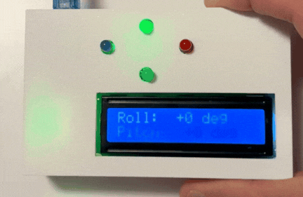
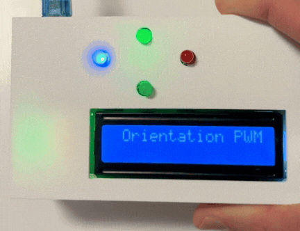

# STM32F4 FreeRTOS Motion‑Controlled PWM Demo

    

## Project Overview
This repository contains a compact real‑time control application for the **STM32F4** series.  
It captures motion data from an **MPU‑6050 IMU**, fuses the readings with a lightweight Kalman filter, and translates the result into smooth **PWM** signals for 4 LEDs. Live roll & pitch values are also shown on a **16×2 LCD** and streamed over **UART** for debugging.

---

    

## Highlights
- **FreeRTOS‑based multitasking** for deterministic behaviour
- **Sensor fusion** with a single‑precision Kalman filter
- **Zero‑copy task notifications** instead of queues for ISR ↔ task messaging
- **PWM updates** on four independent channels
- **User feedback** on both LCD and serial console

---
## Tech Stack
| Layer            | Tools & Libraries                              |
|------------------|-------------------------------------------------|
| Firmware         | C11, FreeRTOS V10.3.1, STM32Cube HAL            |
| MCU / Board      | **STM32F446RE** on a Nucleo-64 development board (Nucleo-F446RE)          |
| Sensors / I/O    | MPU‑6050 (I²C & INT),  PWM, 16x2 LCD, Potentiometer    |
| Toolchain        | STM32CubeMX  • ST‑Link     |

---
## Quick Tour
1. **Data Ready INT** from the MPU‑6050 wakes an ISR.  
2. ISR uses **`xTaskNotifyFromISR`** to unblock the sensor task.  
3. **Sensor Task** reads raw accel/gyro, feeds Kalman filter.  
4. **Actuator Task** maps roll & pitch → PWM pulses (TIM2 CH1‑CH4).  
5. **UI Task** prints angles on LCD.  

